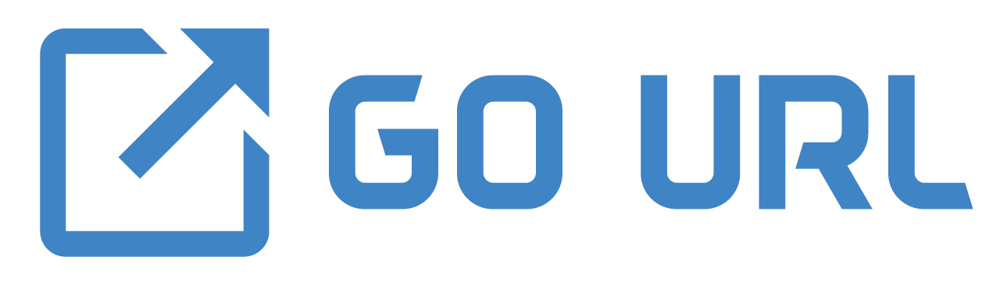

<div align="center">
    
</div>

> A simple npm packege to go to any specific url by click event. Just add data-href to any element.

### Install packege
```bash
npm install gourl --save-dev
// or
npm install gourl -D
```

### CDN
```html
https://unpkg.com/gourl
```


Include packege to your project
```js
require('gourl');
```

Now you can add `data-href` to any element to go a specific url by click.

```html
<button data-href="https://www.google.com/">click</button>
<button data-href="https://www.google.in/" data-target="_blank">click</button>
<a href="#" data-href="https://www.facebook.com">facebook</a>

<input type="text" value="instagram" data-href="https://www.instagram.com" data-target="_blank">

<br> <br>

<span data-href="https://www.youtube.com" data-target="_blank">youtube</span>

```

[Demo](https://codepen.io/kingRayhan/pen/rJyadw)

#### Available attribue

* `data-href` - put your hyperlink here to go
* `data-target` - put url target method. supported values `_blank` and `_self` (**Default**)
